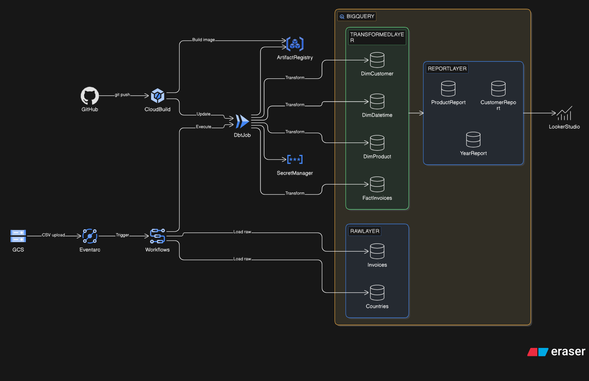

# Retail Data Platform - Serverless ELT on Google Cloud Platform

[](https://opensource.org/licenses/MIT)
[](https://www.terraform.io/)
[](https://www.getdbt.com/)
[](https://cloud.google.com/)

> A production-grade, event-driven ELT data pipeline built with Google Cloud Platform's serverless technologies, infrastructure-as-code, and modern data transformation practices.

## 🎯 Project Overview

A modern, serverless data platform demonstrating event-driven architecture and infrastructure-as-code best practices on Google Cloud Platform. The platform automatically processes retail transaction data through an end-to-end ELT pipeline, from raw CSV ingestion to transformed data marts ready for analytics.

> **📚 Learning Context:** This project was developed as part of a hands-on practice lab in the **GCP Masterclass** taught by [Connect MIT](https://www.connectmit.com/), applying advanced cloud data engineering patterns and best practices in a real-world scenario.

**Key Features:**
- 🚀 **Fully Serverless** - No infrastructure to manage (Cloud Run, Cloud Workflows, BigQuery)
- ⚡ **Event-Driven** - Automatic pipeline triggering via Eventarc on file upload
- 🏗️ **Infrastructure as Code** - 100% Terraform-managed with DDD architecture
- 🔄 **GitOps CI/CD** - Automated builds and deployments via Cloud Build
- 📊 **Modern Data Stack** - dbt for transformations, BigQuery for analytics
- 🔒 **Security-First** - 3-tier IAM with service accounts, secrets in Secret Manager

## 📐 Architecture



### Event-Driven Pipeline Flow

1. **Ingestion**: CSV files uploaded to GCS bucket
2. **Trigger**: Eventarc detects `object.finalized` events
3. **Orchestration**: Cloud Workflows executes ETL steps
4. **Load**: Raw data loaded to BigQuery tables
5. **Transform**: Cloud Run job executes dbt transformations
6. **Serve**: Transformed data marts available for analytics

### Infrastructure Modules

```
infra/
├── modules/
│   ├── platform/      # Foundation (APIs, IAM, storage, CI/CD)
│   ├── pipeline/      # Orchestration (Workflows, Eventarc, dbt job)
│   └── observability/ # Monitoring (planned)
```

## 📊 Data Pipeline

**Source Data:**
- `countries.csv` - 239 country records
- `invoices.csv` - 541,909 retail transactions

**Data Lineage:**
```
Raw Layer → Transformed Layer → Report Layer
├─ raw_country        ├─ dim_customer (4,380)      ├─ report_customer_invoices
└─ raw_invoice        ├─ dim_datetime (23,260)     ├─ report_product_invoices
                      ├─ dim_product (16,282)      └─ report_year_invoices
                      └─ fct_invoices (397,884)
```

